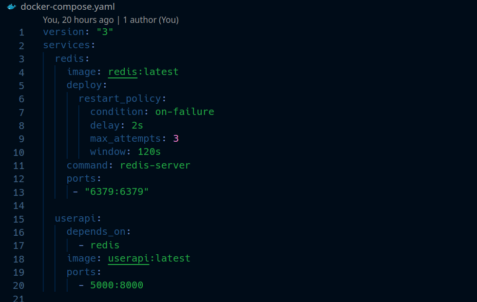

# Author

CLAUDE NGASSA

## Description

This repo is the revised repo for my DEVOPS project

There are all labs. 

# Note about the project 

This is how the project is explained :

##### - Part 1, 2 and 4 are described in the userapi [README](https://github.com/eptec-lab/DEVOPS_FINAL/tree/main/userapi#part-1--create-a-web-application)

##### - Part 3 is described is the iac [README](https://github.com/eptec-lab/DEVOPS_FINAL/tree/main/iac#part-3--apply-iac-using-vagrant-gitlab-healthcheck-and-ansible)

##### - Part 5 is described in the root [README](https://github.com/eptec-lab/DEVOPS_FINAL#readme)

##### - Part 6 is described in the k8s [README](https://github.com/eptec-lab/DEVOPS_FINAL/blob/main/k8s/README.md)

##### - Part 7 is described in the istio [README](https://github.com/eptec-lab/DEVOPS_FINAL/blob/main/istio/README.md)

### *** Useful links for each part are listed in each README *** 
## Not finished

I encountered some issues on the deployment on part 7 and monitoring part 8 

Need to read more articles on that and practice more on these labs

# Part 5 : Make container orchestration using Docker Compose

In this part we created a docker compose file for orchestration :

To learn more about usecase of Docker-compose, refere to this [lab](https://github.com/adaltas/ece-devops-2022-fall/blob/main/modules/06.docker-containers/lab-2.md#5-build-and-run-a-multiple-container-app-with-docker-compose)

#### Steps

1. Docker Compose should be included in your Docker installation (on Windows and Mac at least). If not, install it using the official [instructions](https://docs.docker.com/compose/install/).

2. Build the Docker image (in this case userapi -> instruction to build image [here](https://github.com/eptec-lab/DEVOPS_FINAL/tree/main/userapi#write-a-dockerfile-and-build-a-docker-image).

3. Start the containers with `docker-compose up`

6. Visit `localhost:3000` in your web browser and hit refresh a couple of times

7. Stop the containers by running `CTRL+C` in the previous terminal

#### Useful links for this part

- [Docker compose commands](https://docs.docker.com/engine/reference/commandline/compose_ls/)

