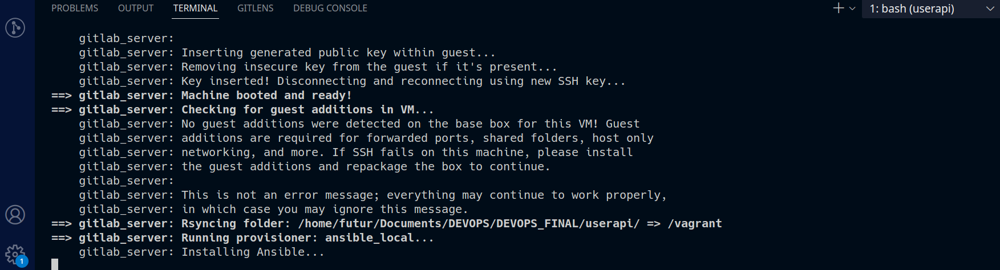

# Author

Claude NGASSA

# Part 3 : Apply Iac using Vagrant, Gitlab healthcheck and Ansible

In this part, we applied Iac using Vagrant, Gitlab and Ansible using declarative approach

> Might have Virtualbox and Vagrant installed in your computer. The steps for installing both :

- Virtualbox : [Here]( https://www.virtualbox.org/wiki/Downloads);
- Vagrant : [Here](https://www.vagrantup.com/downloads.html);

We want to add a new VM in Ansible. In order to do that, we run this command :

```bash
vagrant box add Centos/7 
```

It will download a new Centos in VirtualBox as shown :


For creating a virtual machine (VM), run the command:

```bash
vagrant up
```

> **Some Vagrant commands that manage the VMs**:

> [Useful link for vagrant commands](https://opensource.com/article/21/9/test-vagrant)

Now, we can connect to the VM using this command :

```bash
vagrant ssh
```


It will open a session in the VM and you can run any bash commands being inside the Linux VM (like `ls`, `pwd`, etc.) 
 
The configurations of our VM (provisioning, ...) ar located in this [VagrantFile](../iac/Vagrantfile)
In the next part, we have to install Gitlab and Ansible for Healthcheck

### Synchronisation

As requested, i used the synchronisation for this project using the *sync folder*


Learn more about what is sync folder [Here](https://developer.hashicorp.com/vagrant/docs/synced-folders/basic_usage)

### GitLab installation  


All the necessary configurations are in the [Vagrantfile](../iac/Vagrantfile)
A *playbooks/* directory contains Ansible playbooks to install GitLab and run health checks

> I used the configurations given by teacher in the lab.

We will use [`ansible_local` provisioner](https://www.vagrantup.com/docs/provisioning/ansible_local.html) what will install Ansible on [CentOS 7](https://www.centos.org/) Linux distribution virtual machine by [Vagrant](https://www.vagrantup.com/). So, you don't need Ansible on your host OS!

Run the command:

```bash
vagrant up
```



About Ansible :


It will take 5-10 min to install all the necessary software including required packages, GitLab instance, and databases.


### Test the installation 


Just open in your browser the URL - http://localhost:8080. If you see a GitLab sign in page, that means the VM is successfully provisioned.

> You can log in by using the `root` username and a password that is randomly generated and stored in `/etc/gitlab/initial_root_password` inside the VM.
 

Run a health check using `curl`:
  - Connect to the VM using `vagrant ssh`.
  - Run the command:

    ```bash
    curl http://127.0.0.1/-/health
    GitLab OK
    ```

Run the `gitlab/healthcheck` role:
  - Connect to the VM using `vagrant ssh`.
  - Run the playbooks using the right tag (replace `TAG`):

    ```bash
    ansible-playbook /vagrant/playbooks/run.yml --tags TAG -i /tmp/vagrant-ansible/inventory/vagrant_ansible_local_inventory
    ```
    

### Useful links for this part :

- Gitlab installation on CentOS : [the official documentation](https://about.gitlab.com/install/#centos-7)

- For more informations about Healthcheck with Gitlab: [GitLab Health Check doc](https://docs.gitlab.com/ee/user/admin_area/monitoring/health_check.html)

### The part 4 is in the [Userapi](https://github.com/eptec-lab/DEVOPS_FINAL/tree/main/userapi#part-4--building-docker-image-of-the-app-and-push-it-to-docker-hub) folder


### Get back to the root [README](https://github.com/eptec-lab/DEVOPS_FINAL#readme)