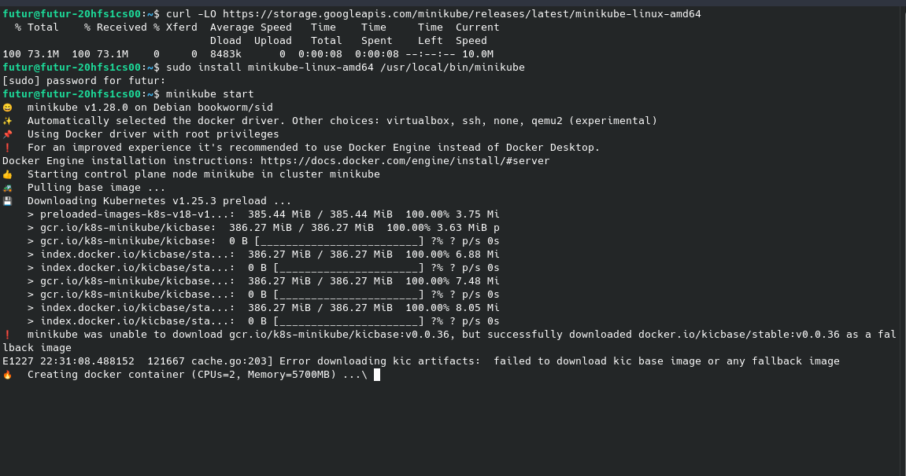
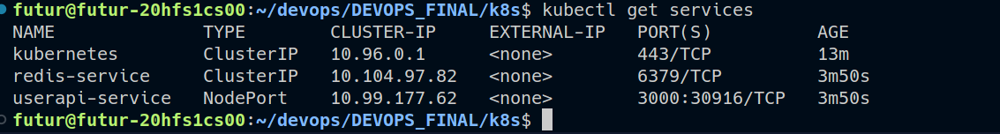
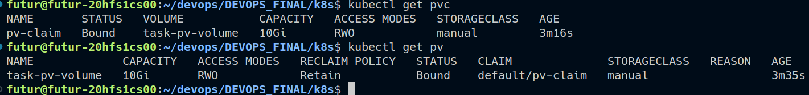

# Author

Claude NGASSA


# Part 6 Orchestration with Kubernetes 

This is a kubernetes orchestration for our [userapi](https://github.com/eptec-lab/DEVOPS_FINAL/tree/main/userapi) application.

All the files are for orchestration in the [k8s](https://github.com/eptec-lab/DEVOPS_FINAL/tree/main/k8s) folder.

## Functionality

1. Install kubernetes, minikube
2. Deploy an app using Manifest yaml files
3. Start a web server


#### 1. Installation of Minikube, kubectl

a. Install BETA version of [minikube](https://kubernetes.io/docs/tasks/tools/install-minikube/) by following the instructions depending on your OS.




b. [Install kubectl](https://kubernetes.io/docs/tasks/tools/) following the instructions depending on your OS. There is a useful bugfix in the BETA version so please choose that.

- Ensure Hyper-V is enabled on Windows with Powershell command `Enable-WindowsOptionalFeature -Online -FeatureName Microsoft-Hyper-V-All` (right click powershell icon and select 'run as administrator' from the launch options)
- Set hyperv as your minikube container runtime with `minikube config set driver hyperv`

c. Start Minikube with it driver by replacing <> by the name of your driver ([kvm2 driver](https://minikube.sigs.k8s.io/docs/drivers/kvm2/) or [virtualbox driver](https://minikube.sigs.k8s.io/docs/drivers/virtualbox/) or [docker driver](https://minikube.sigs.k8s.io/docs/drivers/docker/)):

```
minikube start --driver=<>
```

With Docker in this case, we have :
- Start Minikube with:
```
minikube start --driver=docker
```

Verify that everything is OK with:
```
minikube status
```

d. Verify that everything is OK with:

```
minikube status
```

#### 2. Deploy an app using Manifest yaml files

We created and configured different yaml files respectively for service, deployment, persistent volumes and persistent volume claim

> We complete the different yaml files inside the labs

Once the deployment file is created and configured, run:
    
    1. Deployment  
        
        ```
        kubectl apply -f deployment.yaml
        ```

    2. Service launch
        
        ```
        kubectl apply -f service.yaml
        ```

    3. Deploy a persistent volume
        
        ```
        kubectl apply -f persistent-volume.yaml
        ```

    4. Deploy volume claim
        
        ```
        kubectl apply -f persistent-volume-claim.yaml
        ```


Useful commands for creating service and volumes :

> Create service:

```bash
kubectl create -f service.yaml
```

> Setup persistent volume:

```bash
kubectl create -f persistent-volume.yaml
``` 

> Setup persistent volume claim:

```bash
kubectl create -f persistent-volume-claim.yaml
```


> Get the name of the userapi service:

```bash
kubectl get services
```


> Get the name of the persistent volumes created and persistent volume claim :

```bash
kubectl get services
```



## Useful ressources for this part
- Learn more about Using the [deployment documentation](https://kubernetes.io/docs/concepts/workloads/controllers/deployment/).
- Learn how to use the [service documentation](https://kubernetes.io/docs/concepts/services-networking/service/)

- [Container orchestration with Kubernetes](https://github.com/adaltas/ece-devops-2022-fall/blob/main/modules/07.container-orchestration/index.md#container-orchestration--with-kubernetes)

-[Storage in Kubernetes](https://github.com/adaltas/ece-devops-2022-fall/blob/main/modules/08.storage-in-kubernetes/index.md#storage-in-kubernetes)

- [Kubernetes concept](https://kubernetes.io/docs/concepts/)

##### [Get back to the root README](https://github.com/eptec-lab/DEVOPS_FINAL#readme)