# Part 1 : Create a web application


User API web application
It is a basic NodeJS web application exposing REST API that creates and stores user parameters in Redis database.

Functionality
Start a web server
Create a user
Update a user
delete a user


### Creating a web application

This application is written on NodeJS and it uses Redis database.
Installation
    - Install NodeJS
    - Install Redis
    - Install application

Go to the root directory of the application (where package.json file located) and run:

npm install 
Usage
Start a web server
From the root directory of the project run:

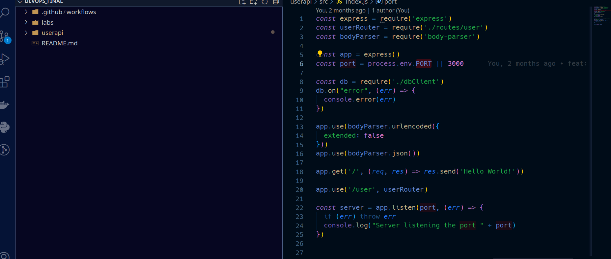


npm start
It will start a web server available in your browser at http://localhost:3000.


Create a user
Send a POST (REST protocol) request using terminal:


curl --header "Content-Type: application/json" \
  --request POST \
  --data '{"username":"claudengassa","firstname":"Claude","lastname":"Ngassa"}' \
  http://localhost:3000/user

It will output:

{"status":"success","msg":"OK"}
Another way to test your REST API is to use Postman.

Testing
From the root directory of the project, run:
```
npm test
```
It will test this app locally

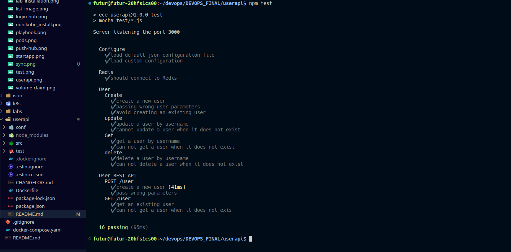


#### !Important

Must be sure that you've Redis installed and runned inside your computer
If it's not the case, follw this link to install redis : 
    
    Windows: https://redis.com/ebook/appendix-a/a-3-installing-on-windows/a-3-2-installing-redis-on-window/
    MacOS: brew install redis or https://redis.io/topics/quickstart
    Linux or MacOS: https://redis.io/topics/quickstart

    Try it inside the terminal: npm run test


# Part 2 : APPLY CI/CD using Git actions and Microsoft azure

In this part, we apply Continuous integration and Continuous Development. 
Theses actions are called in a workflow 
> You can learn more about what is an action workflow [Here](https://docs.github.com/en/actions/using-workflows/about-workflows#:~:text=A%20workflow%20is%20a%20configurable,or%20at%20a%20defined%20schedule.)


### 1- Creation of a workflow for Node.js application

The process of creating a workflow is explained in this [documentation](https://docs.github.com/en/actions/guides/building-and-testing-nodejs).  


> Note. Don't forget to commit and push your workflow configuration in the `.github/workflows` folder **under the root** of you Git repository.

The aim here is to automatically and continuously test each commit for our application
After that, we must add a Redis service container for test each parameter. 
In order to improve your Workflow to connect Node.js application to Redis, uses this documentation:
  - [About service containers](https://docs.github.com/en/actions/guides/about-service-containers)
  - [Creating Redis service containers](https://docs.github.com/en/actions/guides/creating-redis-service-containers)

Then we can configure this workflow as follow :

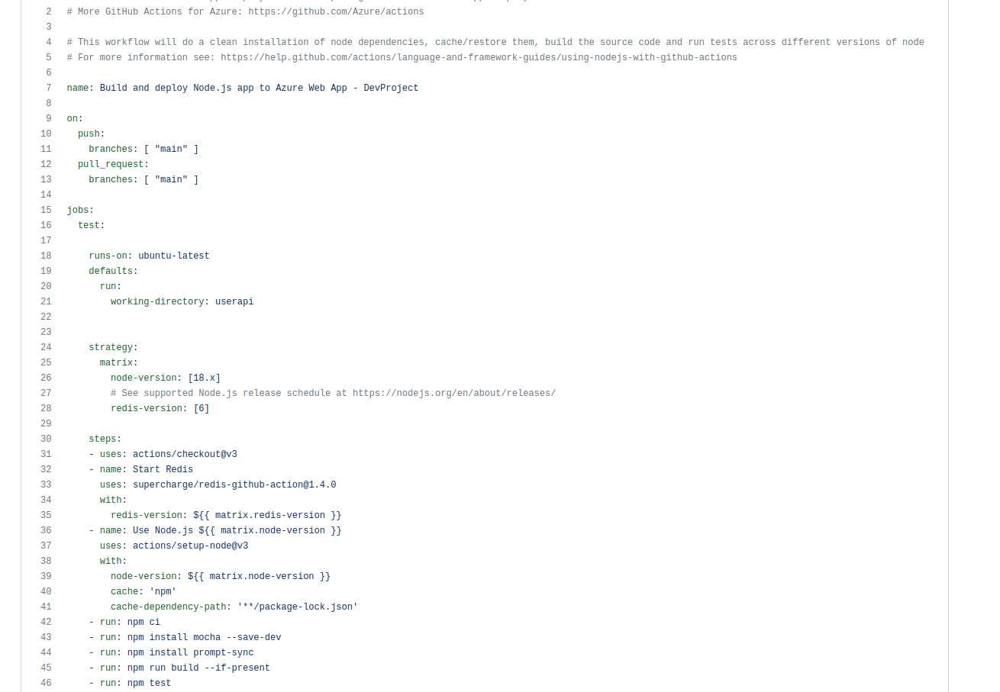


### 2- Continuous Delivery (Deployment) with Microsoft Azure

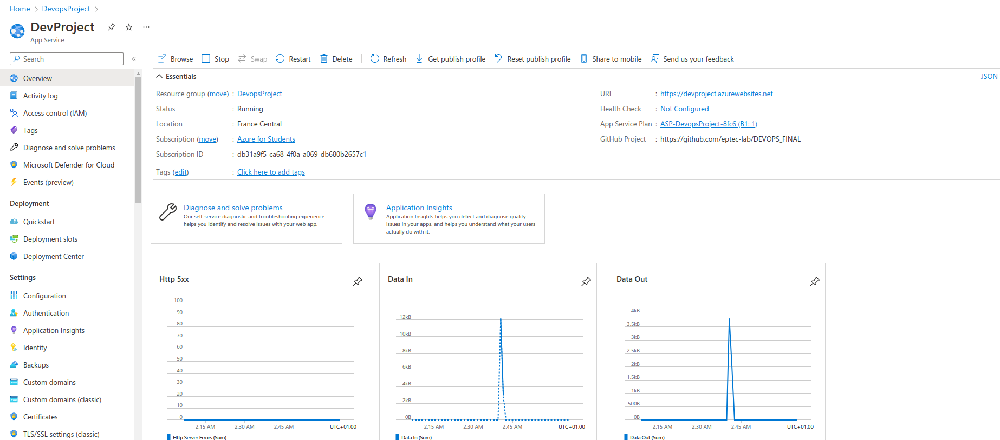

Heroku [became no longer free](https://blog.heroku.com/next-chapter), we will deploy the web app with Microsoft Azure Cloud.


1. First create your account. You have two options:

- [Student account](https://azure.microsoft.com/en-us/free/students/) povides 100$ credits available for 1 year.
- [Free trial account](https://azure.microsoft.com/en-us/free/) povides 200$ credits available for 1 month.
Then connect to your [azure portal](https://portal.azure.com/)

For all necessarilly actions and configurations in Azure, you have to follow this [Tutorial](https://github.com/adaltas/ece-devops-2022-fall/edit/main/modules/04.ci-cd/azure-webapp/webapp-tuto.md)

The following code represents the deployment configuration in the workflow file :

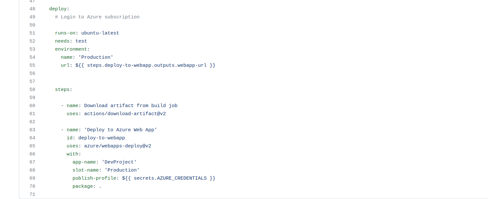


### Results

After a new commit, we obtain the following results about each step of CI/CD :

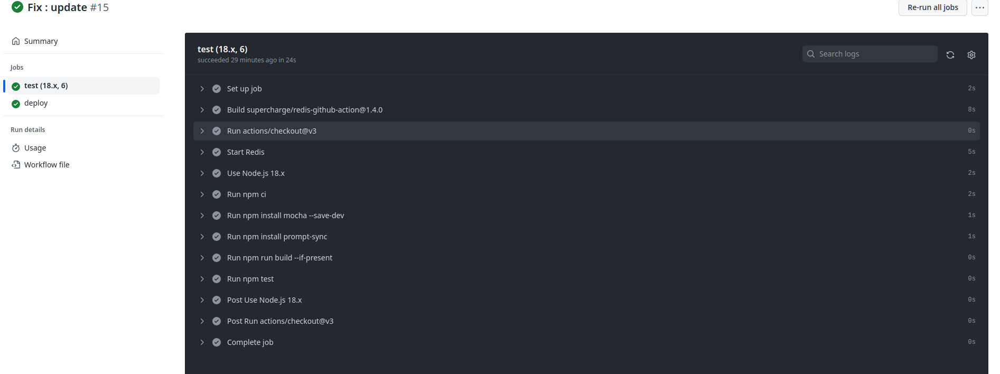

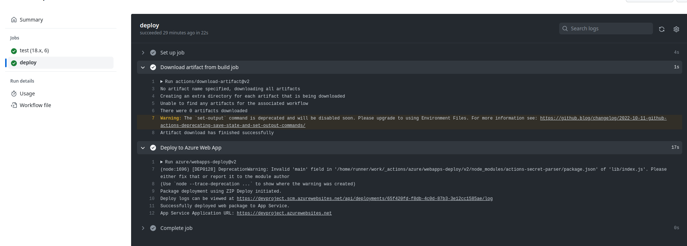


#### Useful links for this section :
- [introduction to GitHub Actions](https://docs.github.com/en/actions/learn-github-actions/introduction-to-github-actions)
- [Azure tutorials]
- https://azure.microsoft.com/en-us/free/students/
- https://azure.microsoft.com/en-us/free/
- https://learn.microsoft.com/en-us/azure/app-service/deploy-github-actions?tabs=applevel
- https://learn.microsoft.com/en-us/azure/app-service/quickstart-nodejs?tabs=linux&pivots=development-environment-azure-portal
- https://azure.microsoft.com/fr-fr/products/cache/#overview
- https://learn.microsoft.com/en-us/azure/azure-cache-for-redis/cache-nodejs-get-started
- https://learn.microsoft.com/en-us/azure/cosmos-db/nosql/tutorial-nodejs-web-app

# Part 3 : Iac approach

This part is in the [iac folder](../iac/)

# Part 4 : Building Docker Image of the App and push it to Docker Hub

I created a *Dockerfile* for this app

We need to firstly install Docker in your computer.

Instructions for installing Docker can be found [Here]()

Before starting, you must have to:
1. Install [Docker Desktop](https://www.docker.com/get-started) following the instructions depending on your OS.
2. Make sure your docker installation is working properly by running the following command in a terminal:
   ```
   docker run hello-world
   ```
### Write a Dockerfile and build a Docker image

I will build an image of userapi application 

> Need to undestand Dockerfile?, refers to this [the documentation](https://docs.docker.com/develop/develop-images/dockerfile_best-practices/#dockerfile-instructions) 


Build the docker container
    - clone the [userapi](https://github.com/eptec-lab/DEVOPS_FINAL/tree/main/userapi)  repository in your computer;
    - Open a terminal (CMD or PowerShell for Windows)
    - Navigate to the repository where the userapi folder is

    Run the following command:
     ```
     docker build -t userapi .
     ```
     - Don't forget the `.` at the end of the command. It is here to tell Docker it should look for the `Dockerfile` in the current directory.

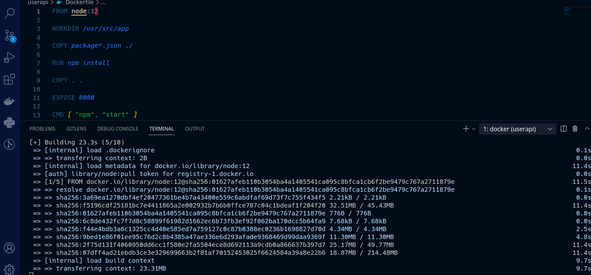


Then, we might check if your Docker container appears in the local Docker images:
   ```
   docker images
   ```

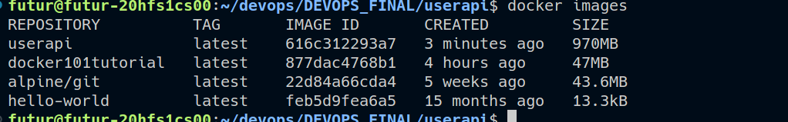

### Publish image on DockerHub

Make sur you're registered on [Docker Hub](https://hub.docker.com/)


Tag your container with the following command:
   ```
   docker tag <AppName> <DOCKER_ACCOUNT_NAME>/<CUSTOM_IMAGE_NAME>
   ```
   > In this case the AppName is userapi

   where `DOCKER_ACCOUNT_NAME` *(ngass12 in my case)* - is your account on Docker Hub, `CUSTOM_IMAGE_NAME` *(userapi in my case)*- the custom name of the image.

   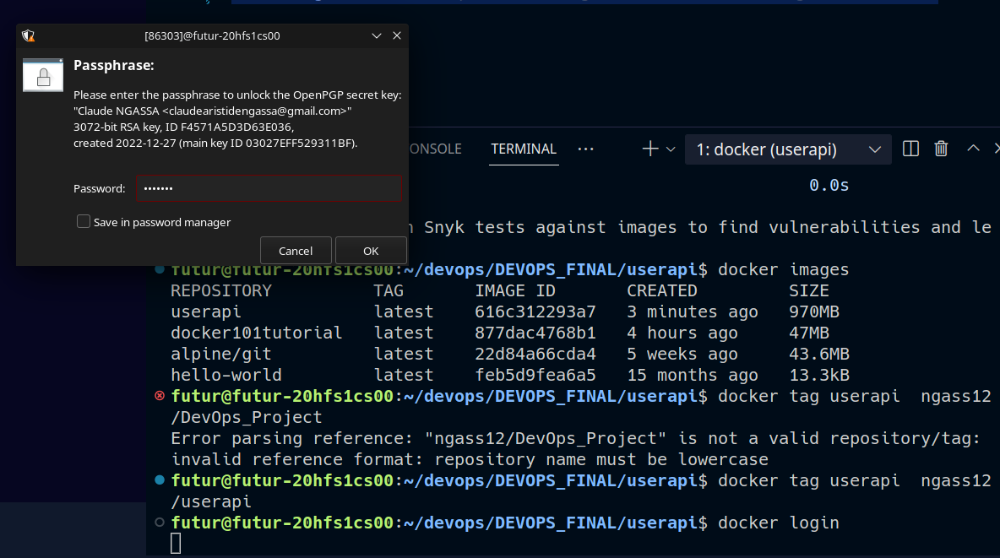

**Note!**:
> It will ask you for a password, make sure to have a pass configured inside your computer

Follow theses steps for pass configuration: https://github.com/docker/docker-credential-helpers/issues/102

Then, Log in to Docker Hub from your terminal:
   ```
   docker login
   ```
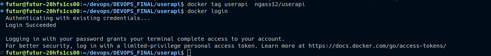


Push the docker image to Docker Hub:

The image is in our local docker engine, we will push it to Docker hub by using this command :
   ```
   docker push <DOCKER_ACCOUNT_NAME>/<CUSTOM_IMAGE_NAME>
   ```

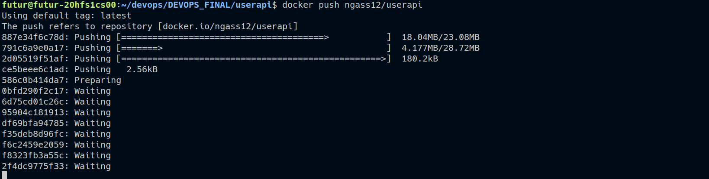

We can see in our remote engine (Docker hub), the image has been pushed and is available for remote access or download 

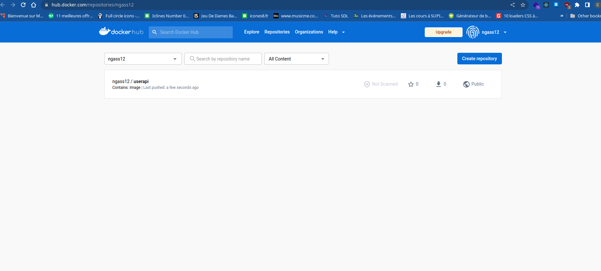


For the next part, you can get back to the root [README](../README.md)

# Author

### Claude NGASSA
